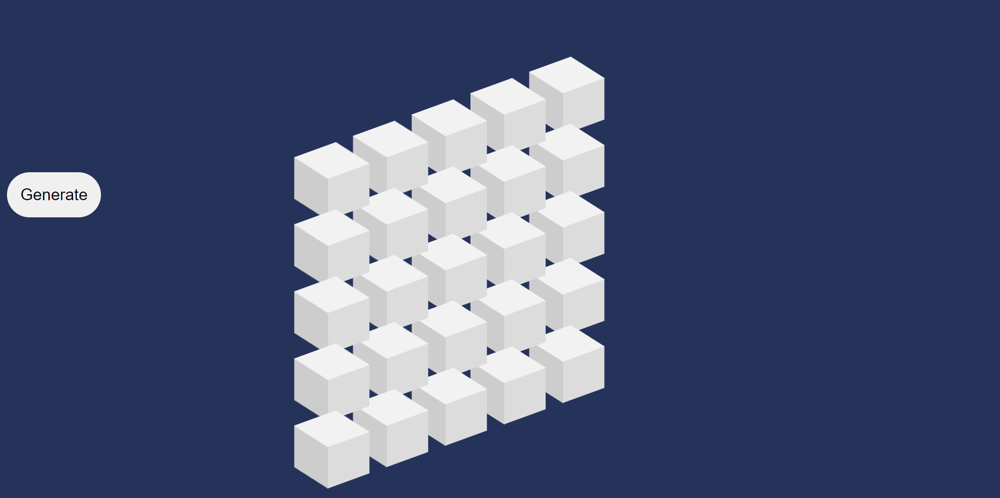
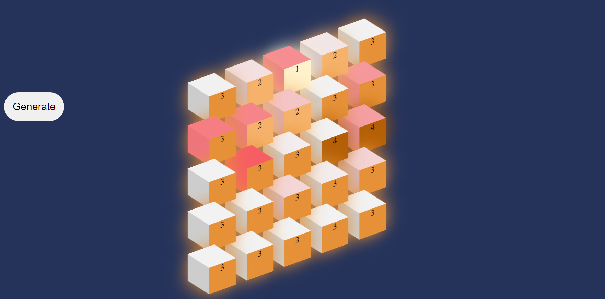
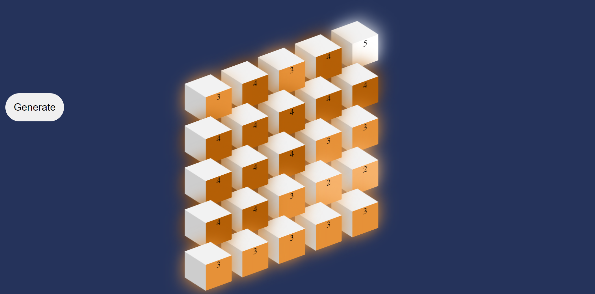
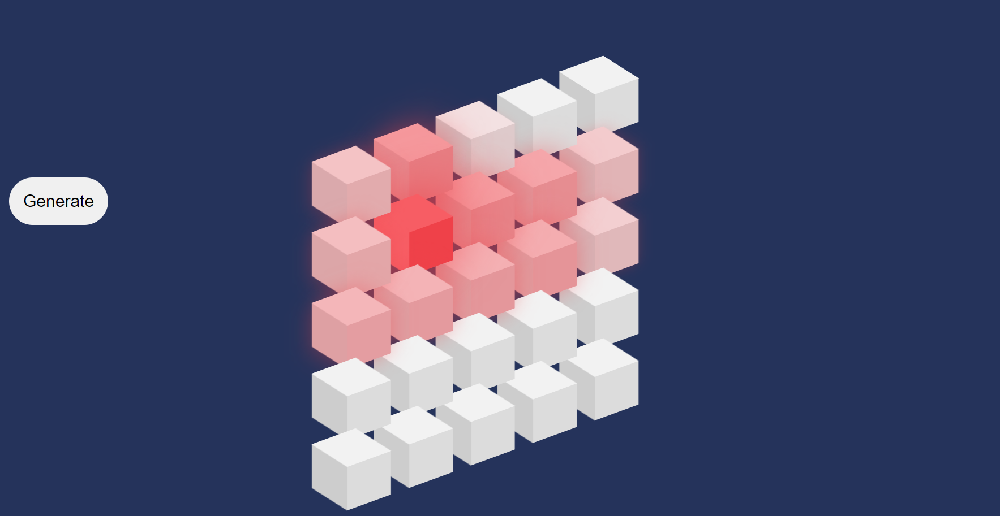

# Neobyte-Solution-Internship

## Generate island 5x5

Code was made using only [JS](https://www.javascript.com/), [HTML](https://www.w3schools.com/html/default.asp) and [CSS](https://www.w3schools.com/css/)

You can check code here or on [Codepen](https://codepen.io/DvdDvd/pen/QWJZXGe) :)
